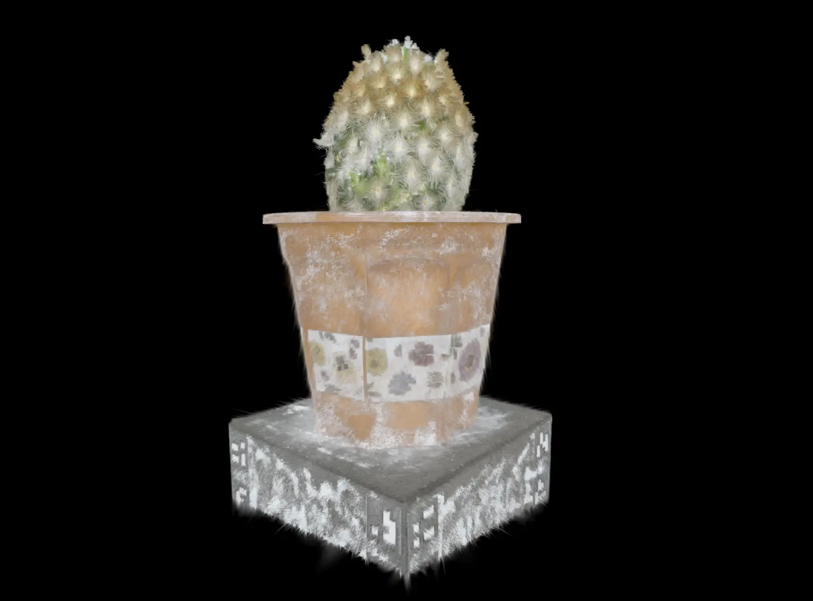

# Gaussian Splatting Viewer

[](https://github.com/Lucas-Wng/GaussianSplatting/actions/workflows/ci.yml)

A real-time **3D Gaussian Splatting** viewer written in Vulkan (C++20). Loads a pretrained `.ply` capture and renders it with free-fly navigation, full view-dependent spherical-harmonic color, and three interchangeable depth-sort backends (CPU, GPU bitonic, GPU radix).



## Features

- Parses binary 3DGS `.ply` files (position, full SH color through band 3, opacity, scale,
  rotation) into GPU-ready splat data, with covariance and activations precomputed on the CPU.
- Renders each Gaussian as an instanced quad via the graphics pipeline: EWA covariance
  projection, full view-dependent SH evaluation, and premultiplied-alpha back-to-front
  blending, all in `shaders/shader.slang`.
- Three depth-sort backends, selected at runtime (`G`):
  - **CPU** `std::ranges::sort`.
  - **GPU bitonic** — in-place compute sort over a key/value array.
  - **GPU radix** — an 8-bit-digit LSD radix sort with a hand-written multi-level exclusive
    scan, including a two-level parallel rank computation in the scatter pass (see
    `shaders/radix.slang`).
- GPU timestamp queries drive a live FPS/sort-time/draw-time HUD in the window title, and a
  `--bench` mode prints per-backend timing (see [Performance](#performance) below).
- A headless, CI-run correctness check (`--self-test`) validates the radix sort against
  `std::sort` on random 64-bit keys.
- Free-fly (FPS-style) camera: WASD movement, mouse look, Space/Shift for up/down.
- Vulkan 1.3 dynamic rendering, `synchronization2`, RAII (`vk::raii`), shaders written in
  Slang. Targets macOS/MoltenVK, kept portable to Windows/Linux.

## Performance

`--bench` runs a fixed, deterministic camera orbit under each sort backend and reports mean
sort/draw time and frame rate. On the bundled `cactus.ply` (139,410 splats, Apple M-series
GPU via MoltenVK):

```
mode       mean sort(ms) mean draw(ms)    mean FPS   p99 total(ms)
cpu               27.21        4.90         31.1         35.5
bitonic            3.10        2.76        170.5          7.8
radix              1.11        3.79        204.2          7.6
```

The GPU radix sort is ~24x faster than the CPU `std::sort` it replaced, and ~3x faster than
the bitonic sort, at this splat count.

## Requirements

- Vulkan SDK 1.4+ (provides `slangc`)
- `glfw`
- `glm`

## Build & run

```bash
./run.sh          # configure + build (incremental) + run (loads bundled models/cactus.ply)
./run.sh --clean  # wipe build/ first, then build + run
```

To view a different capture, pass a path:

```bash
build/GaussianSplatting/GaussianSplatting /path/to/scene.ply
```

The loader handles uncompressed float32 3DGS `.ply` files. Shaders and the default model
resolve relative to the executable's own location, so the binary can be launched from any
working directory (`run.sh` still `cd`s into the build output for convenience).

Other entry points:

```bash
build/GaussianSplatting/GaussianSplatting --bench[=N]      # N frames/mode, default 300; prints timing, exits
build/GaussianSplatting/GaussianSplatting --self-test       # headless radix correctness check; exits with pass/fail
```

`--self-test` is also wired up as a CTest target (`ctest --output-on-failure` from `build/`).
CI builds on both macOS and Linux, but only *runs* it on Linux (Mesa lavapipe): GitHub's
hosted macOS runners sit behind a paravirtualized GPU that MoltenVK can't actually
initialize against, so macOS CI is build/compile verification only.

## Controls

| Key | Action |
|---|---|
| `W` `A` `S` `D` | Move |
| `Space` / `Shift` | Move up / down |
| Mouse | Look around |
| `F` | Toggle up-axis correction (COLMAP Y-down → Y-up) |
| `G` | Cycle sort mode: CPU `std::sort` → GPU bitonic → GPU radix |
| `Esc` | Quit |

## Project layout

```
src/main.cpp              # application: Vulkan/window setup, graphics pipeline, draw loop, --bench/--self-test
src/sort_bitonic.hpp      # BitonicSorter: GPU bitonic depth sort (own pipelines + descriptor pool)
src/sort_radix.hpp        # RadixSorter: GPU LSD radix depth sort + scan + headless self-test
src/vk_utils.hpp          # small stateless Vulkan helpers shared by the above (buffers, shader modules, ...)
src/ply_loader.{hpp,cpp}  # binary 3DGS .ply -> GpuSplat[] + AABB (position, cov, SH bands 0-3)
src/camera.hpp            # free-fly / FPS camera
shaders/shader.slang      # EWA splat vertex+fragment shader + full SH evaluation (-> slang.spv)
shaders/compute.slang     # GPU bitonic depth sort (-> compute.spv)
shaders/radix.slang       # GPU LSD radix sort + exclusive scan (-> radix.spv)
assets/cactus.ply         # pretrained capture (copied to run dir as models/cactus.ply)
.github/workflows/ci.yml  # build + --self-test on macOS and Linux
CMakeLists.txt            # build + shader compilation + asset copy + CTest registration
run.sh                    # configure, build, run
```

## Roadmap

- **Phase 0 — baseline (done):** Vulkan instance/device/swapchain, dynamic rendering, Slang
  shader pipeline, GLFW window.
- **Phase 1 — minimal viewer (done):** `.ply` loading, instanced-quad splat rendering, CPU
  depth sort, fly camera.
- **Phase 2 — compute acceleration (in progress):** move projection, sorting, and
  tile-based rasterization into compute shaders.
  - GPU bitonic depth sort (done), GPU radix depth sort (done) — toggle with `G`.
  - Full view-dependent SH color, bands 0-3 (done).
  - Not yet implemented: a compute covariance-projection/visibility-culling preprocess
    (every splat is still projected and drawn regardless of on-screen coverage) and a
    tile-binning compute rasterizer that writes the image directly. Both are architecturally
    bigger changes — they need GPU-driven, compacted draw counts (indirect draw) rather than
    the fixed per-splat instance count used today — and are left for a dedicated pass rather
    than bolted on partially.
